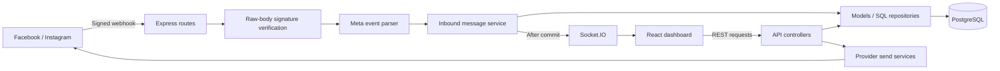
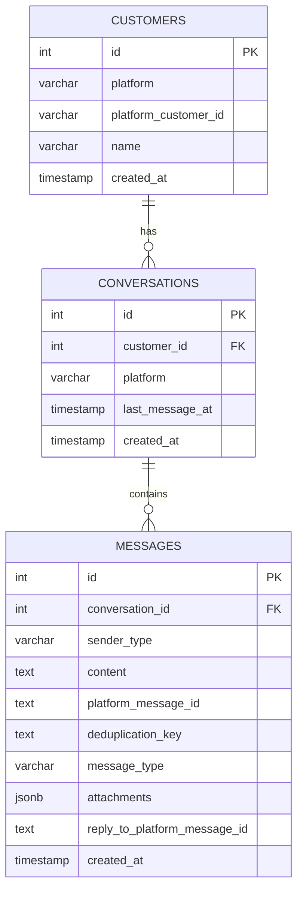

# Architecture and project design

## Problem and objectives

Businesses receiving customer queries on multiple social platforms must switch between separate inboxes. SocialSync demonstrates a shared inbox that preserves the source platform while providing one interface for conversation history, replies, and basic activity analytics.

The implemented objectives are to normalize incoming Facebook/Instagram events, store them reliably, avoid duplicate messages on webhook retries, notify the operator in realtime, and route text replies back to the originating platform.

## System structure



| Location | Responsibility |
| --- | --- |
| `backend/server.js` | Loads configuration and starts the shared HTTP/Socket.IO server |
| `backend/src/app.js` | Express middleware, route mounting, error responses |
| `backend/src/routes` | REST and webhook endpoint registration |
| `backend/src/controllers` | Request handling, response construction, provider selection |
| `backend/src/services` | Inbound transaction orchestration and outbound provider calls |
| `backend/src/integrations/providers/meta` | Provider payload parsing and signature verification |
| `backend/src/models` | Parameterized SQL access; these modules act as repositories |
| `backend/src/sockets` | Dashboard connection and notification handling |
| `frontend/src/App.jsx` | Fetching, conversation selection, sending, unread state, socket subscription |
| `frontend/src/components` | Dashboard, inbox, navigation, platform avatars, bot placeholder |
| `database` | Fresh schema, optional fictional seed, existing-database migrations |
| `backend/test` | Unit and local HTTP tests with synthetic fixtures |

No ORM, queue, background worker, or separate messaging infrastructure is required. Existing outbound services remain in `services`; shared Meta parsing and verification live under the provider directory.

## Incoming message lifecycle

1. Express receives `POST /webhooks/meta`. Its route-specific JSON parser verifies the signature against the exact raw bytes before accepting JSON.
2. Messenger `page` objects use `META_APP_SECRET`. Instagram objects use `IG_APP_SECRET`, falling back to `META_APP_SECRET` when the former is absent.
3. The parser iterates the batch, filters configured account IDs, and produces normalized events. External IDs remain strings. Text, attachment metadata, event timestamps, and reply references are retained.
4. The inbound service opens a PostgreSQL transaction and upserts the customer and conversation.
5. An insert with a unique deduplication key stores the message once. Duplicate retries do not update the conversation timestamp or emit a second notification.
6. For a new message, the conversation activity timestamp advances using `GREATEST`, so an older event cannot move it backward.
7. After commit, Socket.IO emits `new_message`. The frontend refreshes conversations/statistics and updates the open thread or its unread badge.

Message keys contain the platform, receiving account ID, and external message ID. Postbacks without a message ID use a hash of their event fields. Atomic uniqueness is enforced in the database rather than a separate check-before-insert query.

Read, delivery, reaction, echo/self, deleted, unsupported, and unknown events do not become customer messages. The handler acknowledges ignored events. Persistence failures return HTTP 500 so the batch can be retried; previously committed messages remain deduplicated.

## Outbound replies

The reply controller validates nonempty text, finds the conversation, and selects its Facebook or Instagram service. Each service validates configuration and sends trimmed text with bearer-token authorization and a 15-second timeout. A successful provider response is stored as an `agent` message and updates the conversation timestamp. Provider errors return a generic HTTP 502 response without exposing tokens.

Sending to the external provider and saving to PostgreSQL are separate operations. A provider success followed by a database failure can leave an unrecorded delivery. Outbound requests have no idempotency key or retry queue, and replies are not broadcast to other dashboard clients.

## Database model



- Customers are unique by `(platform, platform_customer_id)`.
- Conversations are unique by `(customer_id, platform)`: the current app maintains one conversation per customer/platform pair.
- Non-null message deduplication keys have a partial unique index. Outbound and seeded messages can have null keys.
- `id` and foreign keys are internal database identifiers. Platform IDs are separate opaque strings, and message IDs use `TEXT` to avoid truncation.
- Timestamps use PostgreSQL `TIMESTAMP` without a timezone. Keep the server and database timezone settings consistent; timezone-aware storage is future work.
- Credentials are supplied through environment variables. The unused `platform_accounts` table was removed from the fresh schema; existing installations can retain their legacy table without affecting the app.

## Database setup and migrations

For a new database, apply `database/schema.sql` once. It already includes both migrations' changes. The seed is optional, destructive, and intended only for a disposable demonstration database.

For an older installation, back up its database and apply these scripts in order from the project root:

```powershell
psql -U postgres -d socialsync -v ON_ERROR_STOP=1 -f database/migrations/001_meta_webhook_support.sql
psql -U postgres -d socialsync -v ON_ERROR_STOP=1 -f database/migrations/002_expand_platform_message_ids.sql
```

Migration 001 adds normalized message fields and uniqueness indexes. It can fail if existing rows violate the new uniqueness constraints; resolve duplicates deliberately before retrying. Migration 002 widens opaque message IDs to `TEXT`. Neither migration drops the legacy account table. No migration or seed was run against the user's database during cleanup.

## Analytics definitions

| Field | Definition |
| --- | --- |
| `totalMessages` | All stored customer and agent messages |
| `totalConversations` | All conversations |
| `messagesLast24h` | Messages created within the last 24 hours |
| `activeSessionsLast24h` | Conversations with activity within the last 24 hours; not logged-in users |
| `responseRate` | Percentage of conversations containing at least one agent reply, rounded to one decimal |
| `perPlatform` | Stored message counts grouped by conversation platform |
| `weeklyAnalytics` | Daily message counts for the current Monday-Sunday database calendar week, including zero counts |
| `latestQueries` | Five most recently active conversations with their latest message preview |

Unread counts are browser-memory state for incoming events observed during the current session. They are not saved to the database and reset on refresh. The dashboard shows up to three entries from `latestQueries`.

## Limitations and future work

- One configured Facebook Page and one Instagram professional account; no multi-tenant account isolation or OAuth onboarding.
- No dashboard authentication or authorization. HTTP and Socket.IO CORS are open, and socket messages are broadcast to all connected clients.
- WhatsApp and TikTok are UI/demo categories; no active webhook or send implementation. Social Bot is a placeholder.
- Search text is held in state but does not filter results. Settings, support, notifications, profile, calls, filters, and attachment controls include presentation-only UI. Online indicators do not report actual presence.
- Text-oriented chat; no media rendering/uploading, profile enrichment, historical message import, delivery/read persistence, or reconciliation of external replies.
- No pagination, rate limiting, outbound retry reconciliation, persistent unread state, or guaranteed socket replay. Refresh retrieves stored messages after missed notifications.
- Express 4 conversation handlers do not yet consistently forward rejected database promises to error middleware. Database-outage handling needs further work.
- No configured lint/typecheck pipeline, database-backed integration suite, or browser automation suite. Current validation is described in [testing.md](testing.md).

These are explicit development areas, not completed features. Adding account access control, robust error handling, persistent delivery state, broader tests, and remaining provider integrations would extend the prototype toward deployment.
